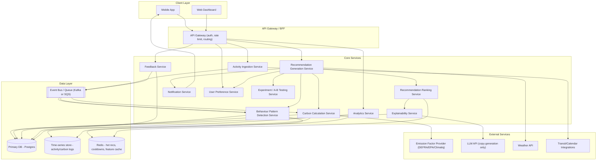

# Personalised Carbon Recommendation Engine
## Part 1 — Product Assumptions, Overview & Architecture

---

## 0. Key Product Assumptions

These are stated up front because they shape every downstream design decision. Change any of these and the architecture should be revisited.

1. **Platform**: Mobile-first app (iOS/Android) with a companion web dashboard. Backend is cloud-hosted, multi-tenant SaaS style (many users, shared infra).
2. **Activity logging is semi-manual**: Users log meals, trips, purchases either manually, via quick-add templates, or via optional integrations (e.g. connected transit card, smart meter API, calendar). We do **not** assume continuous passive sensing (no always-on GPS tracking) — this keeps privacy scope sane and matches how real carbon-tracker apps (Klima, Capture, Commons) work.
3. **Emission factors are third-party sourced** (e.g. DEFRA, EPA, IPCC AR6, or a licensed provider like Climatiq) and versioned — the engine never invents emission factors.
4. **Users have goals** (e.g. "reduce food emissions," "general reduction," "transport focus") set at onboarding, which weight category priority.
5. **One recommendation surface per day** as the default cadence (a "today's recommendations" feed of 1–3 cards), not a constant stream — this is core to the anti-spam philosophy the spec demands.
6. **Cold start = first 7 days of account age**, not 7 logged activities — a user who logs sporadically still ages out of cold-start on a calendar basis, but pattern-confidence gates (below) prevent premature personalisation even after day 7.
7. **ML is additive, not foundational at launch.** V1 ships as a transparent rule + statistics engine (habit detection via frequency/recency stats, scoring via a weighted linear model). This is intentional: explainability is a hard product requirement, and a linear/rule-based scorer is trivially explainable. ML (learned acceptance-probability models, embeddings-based preference fit) is introduced later as a **re-ranker on top of** the rule-based candidate generator, described in the ML roadmap.
8. **LLM usage is strictly scoped to natural-language copy generation** (turning structured explanation metadata into a human-readable sentence) — never for computing kg CO₂e, never for ranking. This is a hard boundary re-stated throughout.
9. **Single-region deployment initially** (data residency simplifies compliance), designed to be regionally shardable later.
10. **"Trust" is a first-class design constraint**: every number shown to a user must be traceable to a stored calculation and a stored emission-factor version. No recommendation is ever "the model just says so."

---

## 1. Product Overview

The system is a **recommendation engine for behaviour change**, not a content recommender. The nearest analogues are Spotify Discover Weekly (personalisation from listening history) and Duolingo's daily practice suggestions (habit-aware, small-scale, feedback-tuned) — but the "content" here is a real-world action with a measurable physical outcome (kg CO₂e), and a recommendation that goes unaccepted has zero cost to the user, so **precision matters more than volume**.

Three properties define the product:

- **Context-aware**: a recommendation is timed against what the user is actually about to do (Thursday → chicken swap), not shown at a random time.
- **Explainable by construction**: every recommendation is generated from a traceable rule/pattern/model path, and that path is stored, not just the final copy.
- **Measurable**: every recommendation carries a kg CO₂e and % number computed from stored emission factors, and the system later checks whether the user's actual behaviour matched the projection (closing the loop for analytics and model improvement).

### 1.1 Recommendation Lifecycle (single sentence version)

`Activity logs → Behaviour Pattern Detection → Candidate Generation (rules) → Scoring/Ranking → Anti-Spam Filtering → Explainability Attachment → Delivery (feed/notification) → Feedback Capture → Pattern & Score Update`

---

## 2. High-Level Architecture



### 2.1 Why this shape

- **Event bus in the middle** decouples ingestion from calculation from pattern detection. A logged activity fires an event; carbon calculation and pattern re-evaluation happen asynchronously so the write path (user logging a meal) stays fast (<200ms), while the heavier pattern-mining can take seconds.
- **Redis cache holds ephemeral scoring state**: cooldown timers, fatigue counters, today's already-shown categories. These need fast read/write and don't need to survive a full outage the way ledger data does.
- **Ranking is separated from Generation** deliberately: Generation produces a wide candidate set from rules ("all actions applicable to this user today"); Ranking scores and prunes it. This separation is what allows swapping in an ML ranker later without touching candidate-generation rules.
- **Explainability Service sits between Ranking and delivery**, not inside Ranking — because explanation generation (including any LLM call) must never block or influence the actual ranking math. It reads the final scored+selected candidate and its stored reasoning trace, then renders copy.

---

## 3. Service Responsibilities

| Service | Responsibility | Reads | Writes |
|---|---|---|---|
| **Activity Ingestion** | Validate & store raw activity logs (meals, trips, purchases, utility readings) | User input, integrations | `activities` |
| **Carbon Calculation** | Convert activities → kg CO₂e using versioned emission factors | `activities`, `emission_factors` | `carbon_logs` |
| **Behaviour Pattern Detection** | Mine recurring habits (day-of-week, time-of-day, category frequency) from logs + feedback | `activities`, `carbon_logs`, `feedback_events` | `behaviour_patterns` |
| **Recommendation Generation** | Apply rule library to produce raw candidate recommendations per user per day | `behaviour_patterns`, `user_preferences`, context signals | `recommendation_candidates` |
| **Recommendation Ranking** | Score candidates, apply anti-spam/cooldown/fatigue filters, select final set | `recommendation_candidates`, `behaviour_patterns`, cooldown cache | `recommendations` (final) |
| **Explainability** | Attach human-readable "why" text + store full reasoning trace | `recommendations`, reasoning metadata | `recommendation_explanations` |
| **Notification** | Decide delivery channel/timing, respect frequency caps | `recommendations`, `user_preferences` | `notification_logs` |
| **Feedback** | Capture accept/dismiss/ignore/partial + downstream behaviour check | User actions | `feedback_events`, `accepted_recommendations`, `rejected_recommendations` |
| **User Preference** | Store goals, disabled categories, dietary/mobility constraints, consent flags | — | `user_preferences` |
| **Analytics** | Aggregate acceptance rate, savings, retention metrics | All tables (read replicas) | Materialised views |
| **Experiment/A-B** | Assign variants, track exposure, compute lift | — | `experiments`, exposure logs |

---

## 4. Data Flow Explanation (end-to-end trace)

**Scenario: Thursday, mature user (30+ days), logs breakfast, engine generates the chicken→paneer card.**

1. **Ingestion**: User logs "chicken curry, dinner" via quick-add. `AIS` validates against schema, writes to `activities`, emits `ActivityLogged` event.
2. **Calculation**: `CCS` consumes the event, looks up the active emission factor for "chicken curry, home-cooked, ~350g" (versioned factor row), computes kg CO₂e, writes to `carbon_logs` referencing the factor's `id + version`.
3. **Pattern detection** (runs nightly batch + is incrementally updated on write for high-confidence signals): `BPD` re-evaluates the user's Thursday-dinner history. It already has a stored pattern `{user_id, pattern_type: "meal_day_of_week", day: THU, food_category: "chicken", occurrences: 4, confidence: 0.86}`. This write nudges occurrences to 5 (if this is the 5th Thursday) and confidence upward.
4. **Generation trigger**: A scheduled job (e.g. 6am local time) or an on-demand API call (`GET /recommendations/today`) invokes `RGS`. It pulls active `behaviour_patterns` for the user, checks today's day-of-week/time context, and the rule library matches: *"pattern_type=meal_day_of_week AND day=today AND food_category IN high-carbon list → candidate: swap to lower-carbon alternative."* It generates 1 candidate per matching rule (here: chicken→paneer, chicken→lentils as two candidates from the food rule family), plus whatever other categories have matching patterns (transport, energy, etc.) — producing perhaps 6–10 raw candidates.
5. **Ranking**: `RRS` scores each candidate (formula in Part 2), checks cooldown cache (was this exact recommendation shown + rejected in the last N days?), checks category balancing (don't show 3 food cards in a row), and selects the top 1–3 candidates above the confidence/score threshold.
6. **Explainability**: `EXS` takes the selected candidate's stored reasoning trace (`pattern_id`, `emission_factor_ids`, `baseline_value`, `recommended_value`, `rule_id_or_model_version`) and renders the short explanation string, optionally via LLM copy polishing (never LLM-computed numbers). Writes to `recommendation_explanations`.
7. **Delivery**: `NS` checks the user hasn't hit their daily notification cap and pushes the card; `WebDash`/`MobileApp` also renders it in the in-app feed.
8. **Feedback**: User taps "I'll do this" → `FS` writes to `feedback_events` + `accepted_recommendations`, emits `RecommendationAccepted`, which `BPD` consumes to reinforce acceptance-probability for this pattern/action pair.
9. **Loop closure** (a few days later): `ANS`/`BPD` checks whether the user's next Thursday chicken-log actually didn't happen (or was replaced) — informing "long-term reduction" analytics and adjusting confidence.

---

## 5. Cold-Start / Learning / Mature Mode Switching

This isn't three separate code paths — it's **one generation pipeline gated by pattern confidence**, which is simpler to maintain and avoids a jarring mode-switch bug class:

```
if no behaviour_patterns with confidence >= LOW_CONFIDENCE_THRESHOLD:
    → rule library falls back to the "generic safe actions" rule set (cold start)
elif behaviour_patterns exist but confidence < HIGH_CONFIDENCE_THRESHOLD:
    → rule library uses "early pattern" rules (partially personalised, hedged language)
else:
    → rule library uses "mature personalisation" rules (specific day/category swaps)
```

Confidence is computed per-pattern (see Part 2, Behaviour Mining), so a user can simultaneously be "mature" for transport (drives every weekday, obvious pattern fast) and "cold" for shopping (infrequent, noisy signal) — recommendations are generated **per category**, not per user-global-mode. This matches reality better than a single global cold/warm/hot flag.

---

*Continued in Part 2: Recommendation Algorithm Design (behaviour mining, scoring, carbon estimation, anti-spam, explainability, feedback loop).*
